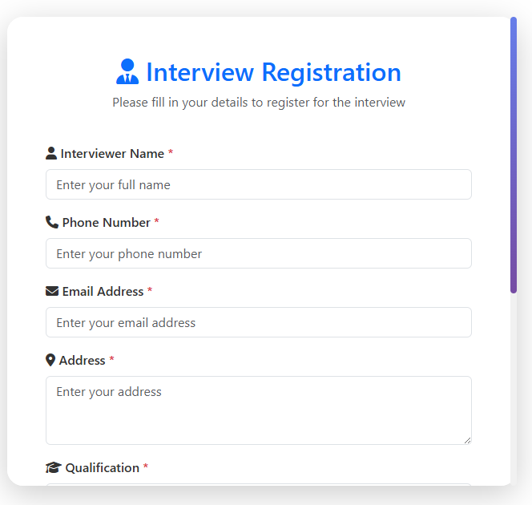
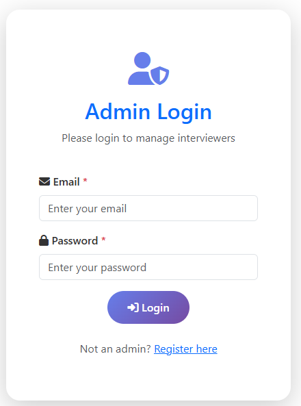
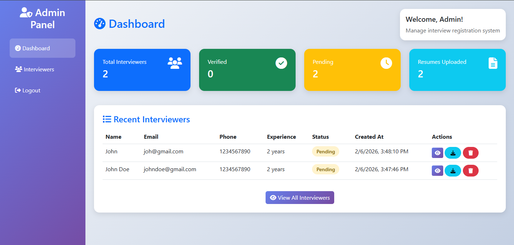
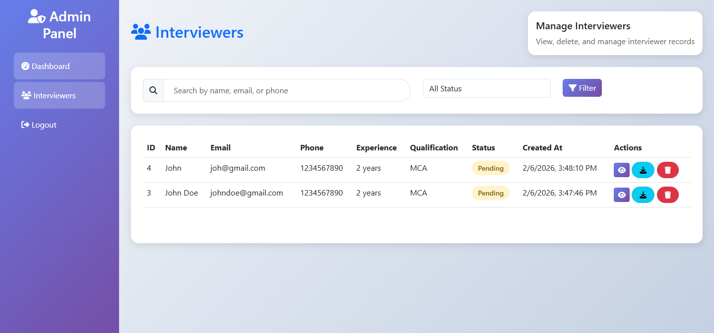

# Interview Registration Web Application

A simple Interview Registration Web Application with backend APIs and Bootstrap UI. The application allows interviewers to register and administrators to manage interviewer records.

## Features

### Interviewer Module
- **Register**: Interviewers can submit their details including personal information, qualifications, experience, and resume upload.
- **View All**: List all registered interviewers.
- **View Single**: View detailed information of a specific interviewer.
- **Update**: Update interviewer details.
- **Delete**: Remove interviewer records.
- **Business Rule**: Prevents duplicate submissions from the same email within 3 months.

### Admin Module
- **Login**: Secure login with default admin credentials.
- **Dashboard**: View statistics and recent interviewers.
- **Manage Interviewers**: View, delete, and download resumes.
- **Search & Filter**: Search by name, email, phone, and filter by status.

## Tech Stack

- **Backend**: Core PHP (OOP)
- **Database**: MySQL
- **Frontend**: Bootstrap 5, jQuery
- **API Testing**: Postman

## Project Structure

```
Interview-Web-App/
├── config/              # Database configuration
├── models/              # Data models (Interviewer, Admin)
├── controllers/         # Business logic
├── api/                 # API endpoints
├── admin/               # Admin panel UI
├── uploads/             # Resume uploads directory
├── index.php            # Interviewer registration page
└── database.sql         # Database schema
```

## Installation


1. **Create database**:
   - Import `database.sql` into MySQL

2. **Database configuration**:
   - Edit `config/Database.php` 

3. **Upload directory permissions**:
   - Ensure `uploads/` directory is writable

4. **Run the application**:
   - Access the interviewer registration page at `http://localhost/Interview-Web-App/`
   - Admin login at `http://localhost/Interview-Web-App/admin/login.php`

## Admin Credentials

```
Email: admin@gmail.com
Password: admin
```

## API Endpoints

All API endpoints return JSON responses.

### Interviewer APIs

| Method | Endpoint | Description |
|--------|----------|-------------|
| POST | `/api/interviewers.php` | Create new interviewer |
| GET | `/api/interviewers.php` | Get all interviewers |
| GET | `/api/interviewers.php?id=1` | Get single interviewer |
| PUT | `/api/interviewers.php?id=1` | Update interviewer |
| DELETE | `/api/interviewers.php?id=1` | Delete interviewer |

### Admin APIs

| Method | Endpoint | Description |
|--------|----------|-------------|
| POST | `/api/admin.php?action=login` | Admin login |
| POST | `/api/admin.php?action=logout` | Admin logout |
| GET | `/api/admin.php?action=profile` | Get admin profile |
| GET | `/api/admin.php?action=interviewers` | Get all interviewers (admin) |
| GET | `/api/admin.php?action=interviewers&id=1` | Get single interviewer (admin) |
| DELETE | `/api/admin.php?action=delete-interviewer&id=1` | Delete interviewer (admin) |
| GET | `/api/admin.php?action=download-resume&resume=filename` | Download resume |

## Postman Collection

A Postman collection with all API endpoints is available in `Interview-Web-App.postman_collection.json`.


## File Upload Restrictions

- **Allowed formats**: PDF, DOC, DOCX
- **Maximum size**: 5MB

## Business Rules

1. **Duplicate Registration Prevention**: Interviewers cannot register with the same email address within 3 months.
2. **Email Validation**: Valid email format is required.
3. **Phone Validation**: Phone number must be 10-15 digits.
4. **Admin Permissions**: Only admins can manage interviewer records.

## Development

- The application uses PDO with prepared statements for database operations.
- All data is properly sanitized to prevent SQL injection.
- Form validation is implemented on both client and server sides.
- File uploads are handled securely with proper validation.

## Future Enhancements

1. Email OTP verification system
2. Email notifications on registration
3. Interviewer verification system
4. Advanced search and filtering options
5. Export data to CSV/Excel
6. User roles and permissions
7. Audit log for admin actions

## Screenshots

### Interviewer Registration Page


### Admin Login Page


### Admin Dashboard


### Interviewers Management Page

